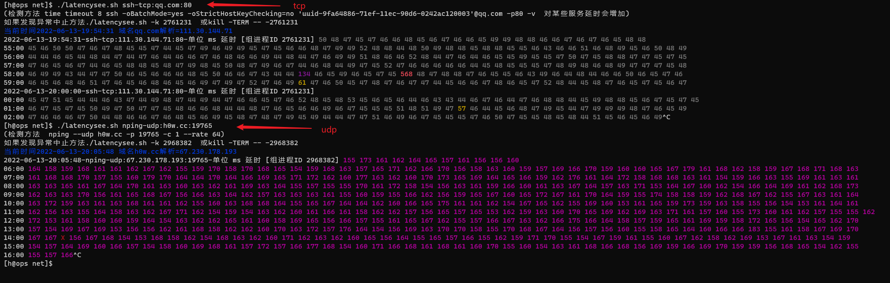

## latencysee.sh
类似"ping"的网络延时检测  支持tcp udp icmp apr协议  
centos7 centos8 rocky8 ubunt20 下测试通过
  
快速使用  
① 下载: wget https://raw.githubusercontent.com/orwithout/scripts/main/net/latencysee.sh  
② cd 进入到下载目录  
③ 给与执行权限 chmod +x ./latencysee.sh  

使用示例  
./latencysee.sh   -k all     #中止所有本脚本已运行的实例  
./latencysee.sh   ssh-tcp:qq.com:80      #ssh测试tcp端口延时 对某些服务延时会增加 (推荐nping模式)  
./latencysee.sh   nping-tcp:ali1.fsbm.cc:19765    #使用nping测试ali1.fsbm.cc的tcp端口19765 如果要后台运行可增加参数 -t file  
./latencysee.sh   nping-tcp:ali1.fsbm.cc:19765  -t file   #使用nping测试ali1.fsbm.cc的tcp端口19765 如果要后台运行可增加参数 -t file  
./latencysee.sh   nping-udp:ali1.fsbm.cc:19765    #需依赖于对端udp服务会不会有回音 (推荐socat联机模式)  
./latencysee.sh   -h    #获取使用帮助  

  
## nif.sh
(newwork info)用于检测两台Linux之间 [端口状态] [延时] [带宽] [路由追踪]  
  
快速使用  
① 下载: wget https://raw.githubusercontent.com/orwithout/scripts/main/nif.sh  
② cd 进入到下载目录  
③ 给与执行权限 chmod +x ./nif.sh  
  
使用示例  
测试tcp :  
./nif.sh qq.com 80  
测试udp :  
./nif.sh 8.8.8.8 -n-u:53 -lnu -etlso  
测试延时 :  
./nif.sh 8.8.8.8 -c-c:8080 -bump  
测试带宽  
./nif.sh 8.8.8.8 -i-i:8080 -bump  
扫描主机信息和路由追踪  
./nif.sh 8.8.8.8 -wait  
全量测试自动向导  
./nif.sh -bump  
  
脚本会按需申请对远端机的ssh连接密码,以及本地sudo提权,  
然后按需在本端和远端机上安装/使用 sshpass nmap socat iperf3 (使用完后自动清理)  
和按需在远端机上设置forward、iptables转发 (使用完后自动复原)  
  
使用说明 :  
https://raw.githubusercontent.com/orwithout/scripts/main/net/nif.sh.help  
